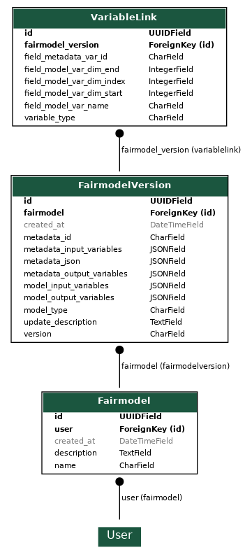

# FAIRmodels-backend

## Data model

This backend application uses a SQL database as backend. This is standard functionality in the Django framework. Django itself uses a model-view-controller software development paradigm. Hence, the data *model* is located in [api/models.py](api/models.py). A visual representation of this model is provided below:



Note: this figure was generated using the following code: `python manage.py graph_models -o data_structure_fairmodels_backend.png api`

The following (relational) objects are described below:

### User
The user representation who creates the FAIRmodel object

### Fairmodel
The high-level object for an individual FAIR model

Properties:
* id: the unique identifier
* user: reference to the User object who created the FAIR model object
* created_at: creation date/time
* name: Name of the FAIR model object
* description: Description of the FAIR model object

### FairmodelVersion
A FAIR model can have different versions which slightly updated parameters, however having the same aim and target prediction. This object describes a **single FAIR model version**.

Properties:
* 

## Getting Started

### 1. Create and activate virtual environment

```
python3 -m venv .venv
source .venv/bin/activate
```

### 2. Execute migrations

```
python manage.py migrate
```

### 3. Create admin account

```
python manage.py createsuperuser
```

### 4. Run server

```
python manage.py runserver
```
